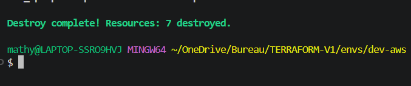
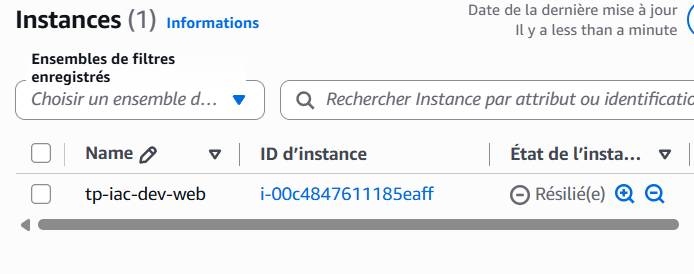
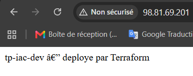

# TP2 — Rapport

## 1. Plan de la Partie D (dérive détectée)

Lors de la vérification avec `terraform plan`, Terraform a détecté une dérive (drift) sur la ressource `aws_security_group.web`[cite: 1]. Il a remarqué que la réalité (règle SSH ouverte à `0.0.0.0/0`) ne correspondait plus à l'état désiré déclaré dans le code.

Terraform a donc proposé une modification sur place (`~ update in-place`) pour supprimer l'accès global et le remplacer par l'adresse IP d'administration stricte (`37.70.218.118/32`) définie dans nos variables[cite: 1].

## 2. Trois informations sensibles trouvées dans le tfstate, et le contrôle qui protège ce fichier

Lors de l'inspection du fichier `terraform.tfstate`, voici trois informations sensibles trouvées en clair[cite: 1, 2] :
1. **L'adresse IP privée de la machine virtuelle** (`"private_ip": "10.20.1.231"`).
2. **Le nom exact de la clé SSH d'administration** (`"key_name": "tp-iac-key"`).
3. **L'identifiant du compte AWS et les ARN chiffrés** (ex: `"account_id": "763186096770"` et clés KMS).

**Contrôle de protection :**
Ce fichier n'est jamais versionné dans Git (protégé par le `.gitignore`)[cite: 2]. Il est stocké de manière sécurisée dans un backend distant S3 configuré avec le chiffrement des données (`encrypt = true`), un accès public totalement bloqué, et un verrouillage natif (`use_lockfile = true`) pour éviter les corruptions lors de déploiements simultanés[cite: 1, 2].

## 3. Tableau comparatif AWS / Azure des ressources écrites

| Rôle | Ressource AWS | Ressource Azure |
|---|---|---|
| Réseau virtuel | `aws_vpc` | `azurerm_virtual_network` |
| Sous-réseau | `aws_subnet` | `azurerm_subnet` |
| Pare-feu d'instance | `aws_security_group` | `azurerm_network_security_group` |
| Machine virtuelle | `aws_instance` | `azurerm_linux_virtual_machine` |
| IP publique | Attribut `map_public_ip_on_launch` (ou `aws_eip`) | `azurerm_public_ip` |

## 4. IMDSv2 et l'affaire Capital One (5 lignes max)

En imposant IMDSv2 (`http_tokens = "required"`), l'attaquant de Capital One aurait été obligé de forger une requête `PUT` avec un en-tête spécifique pour obtenir un jeton, ce qu'une faille SSRF classique (limitée aux requêtes `GET`) ne permet pas : le vol des identifiants aurait donc échoué[cite: 2]. En revanche, cela n'aurait rien changé à la faille initiale du pare-feu (WAF) ni à la violation du principe de moindre privilège du rôle IAM (qui avait accès à tous les buckets S3)[cite: 2].

## 5. Capture de la destruction et de facturation après destruction

## 6. Capture du site internet

